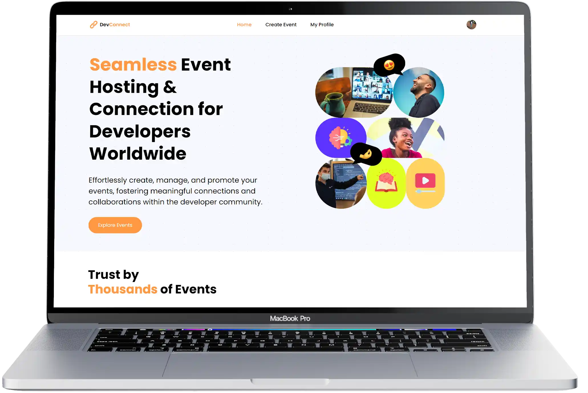

<h1 align='center'>DevConnect</h1>

DevConnect is a platform designed to help users discover and participate in developer events. With DevConnect, you can easily create and find events that interest you. The platform provides a seamless experience for purchasing tickets through Stripe, exploring related events, and using advanced search and filter options.

DevConnect is built using Next.js for server-side functionality, Stripe for payments, and MongoDB for data storage.

Live site: https://devconnect-xi.vercel.app/

#### Key Features

- **Event Discovery:** Find events that match your interests and location.
- **Ticket Purchasing:** Purchase tickets securely through Stripe.
- **Event Management:** Admins can manage events and view attendee information.
- **Profile Management:** Easily view and manage your tickets through your profile page.

#### How to Purchase a Ticket

1. **Select Event:** Choose the event you want to attend.
2. **Purchase Ticket:** Click on "Purchase Ticket" or "Get Ticket" (depending on the event's pricing).
3. **Checkout:** You will be redirected to a secure Stripe checkout page.
4. **Complete Purchase:** Use the provided demo card information (e.g., 42) to complete the purchase.
5. **View Tickets:** After a successful purchase, you will be redirected to your dashboard where you can view your most recent purchase.

#### How to Create an Event

1. **Click "Create Event":** Start by clicking on "Create Event" on the platform.
2. **Fill in Details:** Provide all the required information for your event.
3. **Custom Categories:** If none of the existing categories fit your event, you can create a new one.
4. **Publish Event:** Once you've completed filling out the event details, click "Publish." Your event will be live, and you can edit the details if needed.
